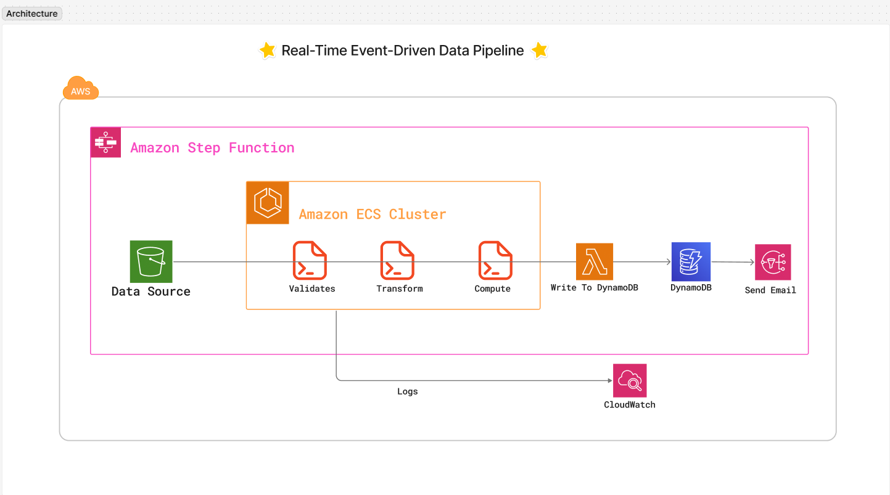

## Overview

This project implements a robust data processing pipeline for e-commerce data using AWS services. The pipeline handles the processing of product, order, and order item data through a series of validation, transformation, and computation steps. The solution leverages AWS ECS, Lambda functions, and Step Functions to create a scalable and maintainable data processing workflow.

<details>
<summary>View Architecture Diagram</summary>


_Figure 1: High-level architecture of the data processing pipeline_

</details>

## Project Structure

<details>
<summary>View Detailed Project Structure</summary>

```
├── assets/                # Static assets and resources
├── data/                  # Sample data files
│   ├── order_items/      # Order items data
│   ├── orders/           # Orders data
│   └── products.csv      # Products master data
├── docs/                  # Project documentation
├── problem/              # Project requirements and specifications
├── scripts/              # Implementation scripts and configurations
│   ├── containers/       # Docker container definitions
│   │   ├── compute/     # Computation logic
│   │   ├── transform/   # Data transformation logic
│   │   └── validate/    # Data validation logic
│   ├── lambda/          # AWS Lambda function code
│   ├── task-definitions/ # ECS task definitions
│   ├── push to cloud.sh # Deployment script
│   ├── s3_structure.txt # S3 bucket structure definition
│   └── step_function.json # AWS Step Function definition
├── test/                 # Test suite
│   ├── local/           # Local testing configurations
│   ├── test_result/     # Test execution results
│   ├── main.py          # Main test script
│   └── manifest.json    # Test manifest
├── requirements.txt      # Project dependencies
└── LICENSE              # MIT License
```

</details>

## Data Structure

The project processes three main types of data:

1. Products: Master product information
2. Orders: Customer order records
3. Order Items: Individual items within orders

<details>
<summary>View Entity Relationship Diagram</summary>


_Figure 2: Entity Relationship Diagram showing data relationships_

</details>

The data is organized in S3 with the following structure:

- `data/`: Raw incoming files
- `processed/`: Successfully processed files
- `temp/`: Temporary files during processing
- `errors/`: Files that fail validation

## Prerequisites

- Python 3.x
- pip (Python package installer)
- AWS CLI configured with appropriate credentials
- Docker (for local development and testing)
- AWS services:
  - ECS (Elastic Container Service)
  - Lambda
  - Step Functions
  - S3
  - IAM (for permissions)

## Installation

1. Clone the repository:

```bash
git clone [repository-url]
cd [repository-name]
```

2. Install the required dependencies:

```bash
pip install -r requirements.txt
```

3. Configure AWS credentials:

```bash
aws configure
```

## Dependencies

- pandas: Data manipulation and analysis
- fsspec: Filesystem specification
- s3fs: S3 filesystem interface
- boto3: AWS SDK for Python

<details>
<summary>View Step Functions Workflow</summary>


_Figure 3: AWS Step Functions workflow diagram_

</details>

## Testing

The project can be tested locally using Docker containers. Here's how to test the pipeline:

1. First, build the Docker images for each service:

```bash
# Build validation service
docker build -t validate-service -f scripts/containers/validate/Dockerfile .

# Build transformation service
docker build -t transform-service -f scripts/containers/transform/Dockerfile .

# Build computation service
docker build -t compute-service -f scripts/containers/compute/Dockerfile .
```

2. Run the local test pipeline using the provided script:

```bash
./scripts/run_pipeline.sh
```

This script will:

- Start all required Docker containers
- Process sample data through the pipeline
- Validate the results
- Clean up resources after completion

<details>
<summary>View Test Results</summary>


_Figure 4: Successful Step Function execution_


_Figure 5: Success notification email_

</details>

## Architecture

The solution uses:

- AWS ECS for container orchestration
- AWS Lambda for serverless functions
- AWS Step Functions for workflow management
- S3 for data storage
- SNS for sending email upon success or failure
- DynamoDB to store the kpis
- CloudWatch to capture logs

## License

This project is licensed under the MIT License - see the [LICENSE](LICENSE) file for details.

## Author

- Marzuk Sanni Entsie

## Contributing

1. Fork the repository
2. Create your feature branch (`git checkout -b feature/AmazingFeature`)
3. Commit your changes (`git commit -m 'Add some AmazingFeature'`)
4. Push to the branch (`git push origin feature/AmazingFeature`)
5. Open a Pull Request

## Acknowledgments

- AWS for providing the cloud infrastructure
- The open-source community for the tools and libraries used in this project
